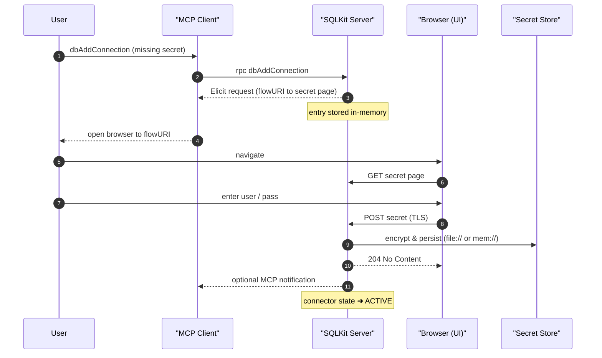
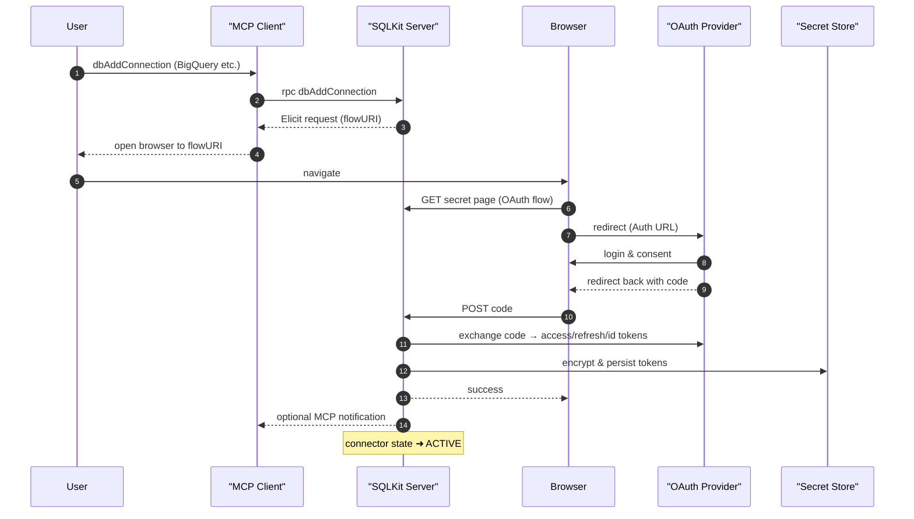
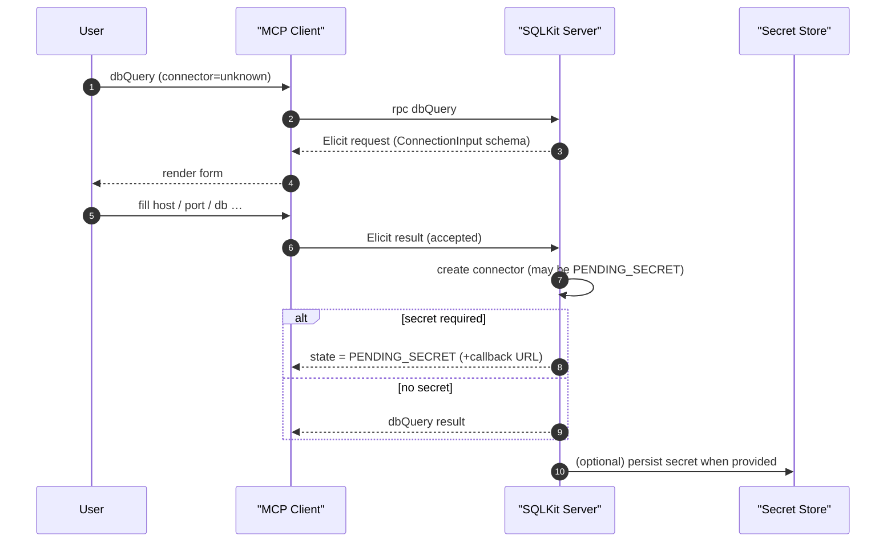

# MCP SQLKit

MCP SQLKit is a **database access toolbox** built on top of the
[MCP protocol](https://github.com/modelcontextprotocol).  It exposes a minimal set
of _tools_ that allow any MCP-host (CLI, Claude Desktop,  etc.)
to:

* register database **connectors** (connection definitions),
* list existing connectors,
* execute **SQL queries** and obtain the result set as JSON,
* execute **SQL DML / DDL statements** and obtain execution metadata.

The project is written in Go, released under the Apache 2 licence and
distributed as a single self-contained executable (`mcp-sqlkit`).


## Table of contents

1.  [Features](#features)
2.  [Quick start](#quick-start)
3.  [Configuration](#configuration)
4.  [Available tools](#available-tools)
5.  [Connector secrets](#connector-secrets)
6.  [Authentication & authorization](#authentication--authorization)
7.  [Secure connector-secret flow](#secure-connector-secret-flow)
8.  [Installation](#installation)
9.  [Building from source](#building-from-source)
10. [Running the unit-tests](#running-the-unit-tests)
11. [Project structure](#project-structure)
12. [Contributing](#contributing)
13. [Licence](#licence)


## Features

• **Multi-database support** – ships with metadata for MySQL, BigQuery and is
  easily extensible to other drivers supported by
  `database/sql`.

• **Namespace isolation** – requests are scoped to the caller’s namespace so
  that multiple users (JWT subjects, OAuth2 e-mails, etc.) can share a single
  toolbox instance without seeing each other’s connectors.

• **Zero-copy result streaming** – query results are streamed directly from
  `database/sql` into JSON without intermediate allocations.

• **Built-in secret management** – credentials are **encrypted with
  [scy](https://github.com/viant/scy)** (Blowfish-GCM by default) and written
  to an abstract secret URL.  Out-of-the-box SQLKit supports `file://` (local
  disk), `mem://` (in-memory) and any additional schemes implemented by the
  scy project – for example Cloud Secret Manager, HashiCorp Vault, etc.  The
  default location is `file://~/.secret/mcpt`.

• **MCP secret-elicitation flow** – if a connector lacks a stored secret SQLKit
  uses the MCP `Elicit` API to instruct the **client** to kick-off a
  browser-based flow.  The user types the credentials (or completes an OAuth2
  consent screen) directly in that page – the secret never passes through the
  MCP client.  Once submitted the connector transitions from PENDING_SECRET to
  ACTIVE automatically.


## Quick start

The easiest way to try the toolbox is to run the server with both HTTP and
STDIO transports enabled:


```bash
go run ./cmd/mcp-sqlkit -a :5000 
```


* `-a :5000` – HTTP listen address (omit to disable HTTP transport).
* `-s`       – enable STDIO transport (useful when the toolbox is launched
               by another process via pipes).

The server will print something similar to:

```
2025/07/12 mcp-sqlkit server listening on HTTP :5000
2025/07/12 mcp-sqlkit server listening on stdio
```

At this point you can connect with any MCP client and invoke the tools listed
in the next section.


## Configuration

All configuration knobs live under the `mcp.Config` structure
(`mcp/config.go`).  The executable will look for a JSON file specified via the
`-c / --config` command-line flag; if not provided sensible defaults are
applied.

```jsonc
{
  // Persisted secret location (defaults to "~/.secret/mcpt")
  "connector": {
    "secretBaseLocation": "/opt/mcp/secrets"
  },

  // Put tool outputs in the `data` field instead of the default `text`.
  "useData": true
}
```

### Pre-configured connectors

In addition to adding connectors at runtime you can **pre-load** connection
definitions via configuration so that they are available immediately after the
server starts.  This is done with the `connector.defaultConnectors` array
(see `db/connector.Config`).  Each entry contains a `namespace` and a list of
`connectors`.

* **Global / shared connectors** – set `namespace` to an empty string or
  `"default"`.  All callers (even unauthenticated) can use them.
* **Per-user connectors** – set `namespace` to the e-mail / subject expected
  in the user’s ID-token.  Only that principal will see the connector.

Example:

```jsonc
{
  "connector": {
    "defaultConnectors": [
      {
        // Shared read-only replica available to everyone.
        "namespace": "default",
        "connectors": [
          {
            "name":   "analyticsRO",
            "driver": "mysql",
            "dsn":    "analytics-ro:3306/analytics",
            // optional inline secret – persisted at first start-up
            "secrets": {
              "URL":  "file://~/.secret/mcpt/mysql/analytics/default",
              "Key":  "blowfish://default"
            }
          }
        ]
      },
      {
        // Private BigQuery connector visible only to alice@example.com
        "namespace": "alice@example.com",
        "connectors": [
          {
            "name":   "bqPrivate",
            "driver": "bigquery",
            "dsn":    "bigquery://project/dataset"
          }
        ]
      }
    ]
  }
}
```

On start-up SQLKit persists any provided secrets (if they are not yet stored)
and registers the connectors under their respective namespaces.

Configuration can also be built programmatically – see
`cmd/mcp-sqlkit/main.go` for a minimal example.

### Drivers & metadata registry

The package `db/driver` blank-imports the most common `database/sql` drivers
(_MySQL, Postgres, SQLite, etc._) **and** the product-specific metadata
registrations used by `github.com/viant/sqlx`.  Import it once in your main if
you use the services outside of the toolbox:

```go
import _ "github.com/viant/mcp-sqlkit/db/driver"
```

Toolbox binaries already import it for you, so no action is required when you
run `mcp-sqlkit`.


## Available tools

The toolbox registers the following MCP tools (see `mcp/tool.go`).

| Tool name              | Description                                   | Input struct                |
| ---------------------- | --------------------------------------------- | --------------------------- |
| `dbQuery`              | Execute a SQL query and return the result set | `db/query.Input`            |
| `dbExec`               | Execute DML/DDL and return rows affected      | `db/exec.Input`             |
| `dbListConnections`    | List connectors visible to the caller         | `db/connector.ListInput`    |
| `dbAddConnection`      | Register a new connector                      | `db/connector.ConnectionInput` |
| `dbUpdateConnection`   | Update an existing connector (upsert)         | `db/connector.ConnectionInput` |
| `dbListTables`         | List tables for a given catalog/schema        | `db/meta.ListTablesInput`   |
| `dbListColumns`        | List columns for a given table                | `db/meta.ListColumnsInput`  |


### Example – query a MySQL database

1. Register a connector (either via `dbAddConnection` or through the browser
   secret-elicitation flow described later). With `dbAddConnection` you pass only
   **non-secret** fields:

```jsonc
{
  "name":   "mysqlLocal",
  "driver": "mysql",
  "host":   "127.0.0.1",
  "port":   3306,
  "db":     "test",
  "options":"parseTime=true"
}
```

   The toolbox expands these into a driver-specific DSN template (e.g.
   `tcp(127.0.0.1:3306)/test?parseTime=true`) and triggers the secret-elicitation
   flow if credentials are missing.

2. Call the `dbQuery` tool with the following payload:

```jsonc
{
  "query": "SELECT id, name FROM users WHERE status = ? LIMIT 10",
  "connector": "mysqlLocal",
  "parameters": ["active"]
}
```

3. The toolbox responds with a JSON array containing the rows.


## Connector secrets

When you add a connector whose credentials are not yet stored the toolbox
transitions it into a **PENDING_SECRET** state and – provided the client
supports the MCP `Elicit` method – initiates a browser-based flow where you can
enter the secret.

• **Basic auth drivers** (e.g. MySQL, Postgres) prompt for _username_ and
  _password_.

• **BigQuery driver** triggers an OAuth2 authorisation code flow and appends
  the obtained token URLs to the DSN automatically.

Secrets are encrypted with [scy](https://github.com/viant/scy) and stored at:

```
<SecretBaseLocation>/<driver>/<database>/<namespace>
```

Key points about secret storage:

* Encryption uses Blowfish-GCM with keys managed by scy; SQLKit never stores
  secrets in plain text.
* The location scheme is pluggable – any URL that scy recognises works
  (`file://`, `mem://`, `gsecret://`, `vault://`, …).
* Changing `SecretBaseLocation` to an empty string switches to `mem://`
  storage so secrets live only for the lifetime of the process. Great for
  demos, **not recommended for production**.


## Authentication & authorization

MCP SQLKit can run **with or without** OAuth 2.0 / OpenID Connect identity
verification.  When an OAuth2 configuration is supplied _and_ the flag
`requireIdentityToken` is set, every inbound MCP request must carry a valid
JWT ID-token (usually passed as `Authorization: Bearer …`).  The toolbox
extracts the subject or e-mail claim to derive the **request namespace** so
that each principal sees only its own connectors.

Minimal JSON snippet enabling token verification (see `mcp.Config`):

```jsonc
{
  "connector": {
    "policy": {
      "requireIdentityToken": true,
      "oauth2Config": {                  // Standard golang.org/x/oauth2 cfg
        "clientID":     "<client_id>",
        "clientSecret": "<secret>",
        "endpoint": {
          "authURL":  "https://idp.example.com/auth",
          "tokenURL": "https://idp.example.com/token"
        },
        "redirectURL": "http://localhost:5000/oauth2/callback",
        "scopes":      ["openid", "email"]
      }
    }
  }
}
```

When the `policy` block is omitted the toolbox falls back to a shared
namespace called **`default`** – useful for local development or CI where no
identity provider is available.


## Secure connector-secret flow

Adding a connector is a two-step operation:

1.  Persist the **connection definition** (driver, DSN, etc.).
2.  Supply the associated **secret** (basic credentials _or_ OAuth token).

Step 2 is performed via a browser-based page started by the Elicit request and
served by SQLKit so that credentials never transit through the MCP client.  The flow is
identical for HTTP and stdio transports and differs only in the type of
credential supplied.

The diagrams below use [Mermaid](https://mermaid.js.org/) (GitHub renders it
automatically).

### Branch A – basic username/password



### Branch B – OAuth 2.0 authorisation code



Security properties:

* Secrets are always submitted over TLS (browser → SQLKit).
* The MCP client never sees the credential – it only carries the **callback
  URL** to the user.
* Secrets are encrypted via [scy](https://github.com/viant/scy) using
  Blowfish‐GCM; keys reside on the host – no plain-text on disk.
* When `secretBaseLocation` is empty, secrets stay **in-memory**; perfect for
  demos but not recommended for production.


### Auto-elicitation when connector is missing

If a user invokes a tool that references **an unknown connector** SQLKit will
activate the MCP **Elicit** protocol method to collect the missing
definition _on the fly_.  The server sends a JSON-Schema describing the
`ConnectionInput` structure; the MCP client renders it as a form, collects the
input and returns it without any secrets.  The subsequent secret flow runs the
same way as in Branch A/B.




## Installation

Pre-built binaries are provided on the [releases page]
(https://github.com/viant/mcp-sqlkit/releases).  Download the archive that
matches your OS / CPU, unpack it and move the `mcp-sqlkit` binary somewhere in
your `PATH`, e.g.:

```bash
curl -L -o mcp-sqlkit_linux_amd64.tar.gz \
     https://github.com/viant/mcp-sqlkit/releases/latest/download/mcp-sqlkit_linux_amd64.tar.gz
tar -xzf mcp-sqlkit_linux_amd64.tar.gz
sudo mv mcp-sqlkit /usr/local/bin/
```

Alternatively you can build and install directly with the Go tool-chain (Go
1.21+ recommended):

```bash
go install github.com/viant/mcp-sqlkit/cmd/mcp-sqlkit@latest
```

The command places the binary in `$(go env GOPATH)/bin` which should already
be on your `PATH` if you installed Go using the official instructions.


## Building from source

The project uses the Go tool-chain – clone and build as usual:

```bash
git clone https://github.com/viant/mcp-sqlkit.git
cd mcp-sqlkit
go build ./cmd/mcp-sqlkit
```

This yields a single binary `mcp-sqlkit`.


## Running the unit-tests

Tests follow a data-driven pattern (see `db/query/cache_test.go` for an
example).  Run the full suite with:

```bash
go test ./...
```


## Project structure

```
├── auth/          – Namespace derivation & JWT/OAuth2 helpers
├── cmd/           – CLI entry-points (currently only mcp-sqlkit)
├── db/            – Database-related logic
│   ├── connector/ – connector management, secret handling, UI flow
│   ├── exec/      – DML/DDL execution service
│   └── query/     – Query service with dynamic record type caching
├── mcp/           – Toolbox service, MCP handler & tool registration
└── policy/        – Security policy primitives
```


## Contributing

Pull requests are welcome – please make sure that:

1. Code is formatted (`go fmt ./...`) and `go vet` passes.
2. New logic is covered by **data-driven tests** that use
   `assert.EqualValues()` from `stretchr/testify`.
3. You do not introduce driver-specific hacks – prefer a generic solution so
   that other connectors can benefit as well.


## Licence

This project is released under the **Apache Licence, version 2.0** – see the
`LICENSE` file for the full text.
